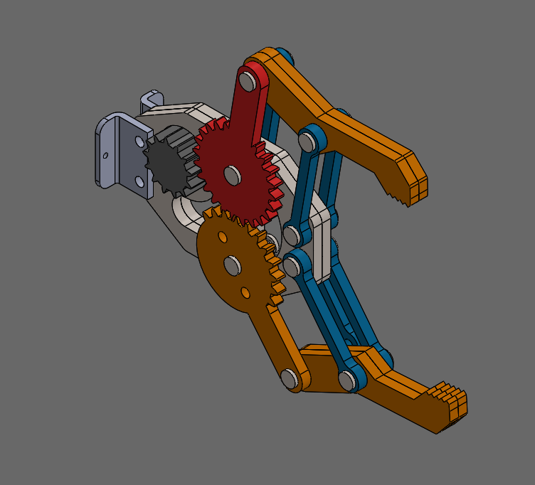

# Gripper

Tugas 2 Github Mekanik KRAI

## Pre-requisite

- Telah mengerjakan Tugas 1 Github Mekanik KRAI, di repo introduction

## Goals

Jika todo berikut udah dikerjain, checkmarknya diubah jadi x (misalnya [x]).

- [ ] Memodifikasi part 5
- [ ] Membuat assembly gripper

## Part 5 Modification

- Extrude nama kalian pada part 5, dimensi dan designnya terserah (pake fitur text di sketch).
- Ubah nama part 5 menjadi ***Part5-Modified***.

**Note**: Github cuma bakal anggap suatu file berubah kalau nama filenya berubah. Kecuali buat text based file, kayak .md, .txt, .html, .docx, dll. Jadi, pengubahan nama ini wajib.

## Assembly Gripper

- Buat assembly baru, beri nama ***Gripper-v0***.
- Berikut gambar refereni dari assembly gripper yang akan dibuat:
  

**Note**: Nanti, kalau semisal ada update sama asemmbly atau salah-satu part bisa diganti penamaan jadi ***Gripper-v1***, ***Gripper-v2***, dst.

## Pengumpulan

Untuk mengumpulkan pengerjaan kalian, buat branch baru dengan nama ***nama-kalian***, contoh ***adi-haditya***. Tujuan dari pembuatan branch ini agar tidak ada tabrakan yang terjadi antara satu orang sama orang lain. Enaknya, nanti pekerjaan tiap orang bakal kesimpen di satu repo tanpa ngehilangin kerjaan orang lain. Caranya adalah sebagai berikut:

1. Buka terminal, atau command prompt, atau git bash.
2. Masuk ke dalam folder repository lokal kalian.
3. Ketikkan perintah berikut:

    ```bash
    git pull
    git checkout -b nama-branch-baru
    git add .
    git commit -m "Nama: Tugas 2"
    git push -u origin nama-branch-baru
    ```

4. Setelah itu, buka browser dan buka repo kalian di Github.
5. Pilih branch baru yang telah kalian buat.
6. Klik tombol ***Compare & pull request***.
7. Isi judul Pull Request dengan ***Nama: Tugas 2***.
8. Klik tombol ***Create pull request***.
9. Cari tau apa guna dari pull request ini dan bagaimana cara kerjanya.
10. Selesai.
